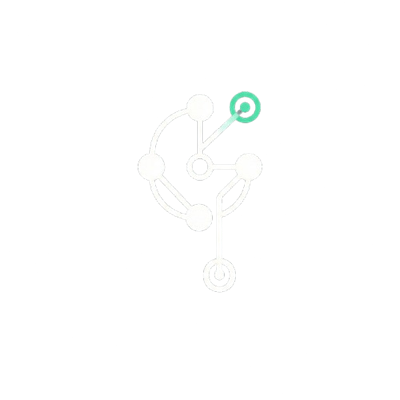

<p align="center">
  
</p>

<h1 align="center">grov</h1>

<p align="center"><strong>Collective AI memory for engineering teams.</strong></p>

Grov automatically captures reasoning from your Claude Code sessions and injects relevant context into future sessions. Your AI remembers what it learned.

## The Problem

Every time you start a new Claude Code session:
- Claude re-explores your codebase from scratch
- It reads the same files again
- It rediscovers patterns you've already established
- You burn tokens on redundant exploration

**Measured impact:** A typical task takes 10+ minutes, 7%+ token usage, and 3+ explore agents just to understand the codebase.

## The Solution

Grov captures what Claude learns and injects it back on the next session.

**With grov:** Same task takes ~1-2 minutes, <2% tokens, 0 explore agents. Claude reads files directly because it already has context.

## How It Works

```
Session 1: Claude learns about your auth system
           ↓
        grov captures: "Auth tokens refresh in middleware/token.ts:45,
                        using 15-min window to handle long forms"
           ↓
Session 2: User asks about related feature
           ↓
        grov injects: Previous context about auth
           ↓
        Claude skips exploration, reads files directly
```

**Zero friction.** You don't change anything about how you use Claude Code.

## Quick Start

```bash
# Install globally
npm install -g grov

# One-time setup (registers hooks in Claude Code)
grov init

# Done. Use Claude Code normally.
claude
```

That's it. Grov works invisibly in the background.

## Commands

```bash
grov init        # Register hooks (run once)
grov status      # Show captured tasks for current project
grov unregister  # Disable grov
```

## How It Actually Works

1. **SessionStart hook** fires when you run `claude`
   - Grov queries its database for relevant past reasoning
   - Outputs context that Claude Code injects into the session

2. **You work normally** with Claude Code

3. **Stop hook** fires when the session ends
   - Grov parses the session's JSONL file
   - Extracts reasoning via LLM (GPT-3.5-turbo)
   - Stores structured summary in SQLite

4. **Next session**, Claude has context and skips re-exploration

## LLM Extraction (Optional)

For smarter reasoning extraction, set your OpenAI API key:

```bash
export OPENAI_API_KEY=sk-...
```

Without an API key, grov uses basic extraction (files touched, tool usage counts).

## What Gets Stored

```json
{
  "task": "Fix auth logout bug",
  "goal": "Prevent random user logouts",
  "files_touched": ["src/auth/session.ts", "src/middleware/token.ts"],
  "reasoning_trace": [
    "Investigated token refresh logic",
    "Found refresh window was too short",
    "Extended from 5min to 15min"
  ],
  "status": "complete",
  "tags": ["auth", "session", "token"]
}
```

## What Gets Injected

```
VERIFIED CONTEXT FROM PREVIOUS SESSIONS:

[Task: Fix auth logout bug]
- Files: session.ts, token.ts
- Extended token refresh window from 5min to 15min
- Reason: Users were getting logged out during long forms

YOU MAY SKIP EXPLORE AGENTS for files mentioned above.
Read them directly if relevant to the current task.
```

## Data Storage

- **Database:** `~/.grov/memory.db` (SQLite)
- **Per-project:** Context is filtered by project path
- **Local only:** Nothing leaves your machine (unless you add cloud sync)

## Requirements

- Node.js 18+
- Claude Code v2.0+

## Roadmap

- [x] Local capture & inject
- [x] LLM-powered extraction
- [x] Zero-friction hooks
- [ ] Team sync (cloud backend)
- [ ] Web dashboard
- [ ] Semantic search

## License

Apache License 2.0 - see [LICENSE](LICENSE) file for details.
