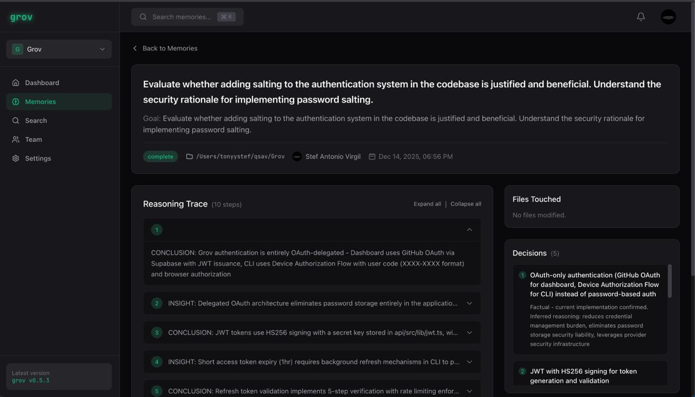

<p align="center">
  
</p>

<h1 align="center">grov</h1>

<p align="center"><strong>Collective AI memory for engineering teams.</strong></p>

<p align="center"><em>When one dev's AI figures something out, every dev's AI knows it.</em></p>

<p align="center">
  <a href="https://www.npmjs.com/package/grov"></a>
  <a href="https://www.npmjs.com/package/grov"></a>
  <a href="https://github.com/TonyStef/Grov/blob/main/LICENSE"></a>
  <a href="https://app.grov.dev"></a>
</p>

<p align="center">
  <a href="https://grov.dev">Website</a> •
  <a href="https://app.grov.dev">Dashboard</a> •
  <a href="#quick-start">Quick Start</a> •
  <a href="#features">Features</a> •
  <a href="#contributing">Contributing</a>
</p>

---

## The Problem

Your team's AI agents are learning in silos.

- Dev A's Claude spends 10 minutes understanding your auth system
- Dev B's Claude does the exact same exploration the next day
- Dev C asks a question that was already answered last week
- Every new session starts from zero

**The waste:** Redundant exploration, duplicate token spend, knowledge that disappears when sessions end.

## The Solution

Grov captures what your team's AI learns and shares it automatically.

```
Dev A: "How does auth work in this codebase?"
        ↓
     Claude investigates, figures it out
        ↓
     Grov captures the reasoning + decisions
        ↓
     Syncs to team dashboard
        ↓
Dev B: "Should we add password salting?"
        ↓
     Claude already knows: "Based on verified team knowledge,
     no - this codebase uses OAuth-only, no passwords stored"
        ↓
     No exploration needed. Instant expert answer.
```

**Measured impact:** Tasks drop from 10+ minutes to 1-2 minutes when team context is available.

---

## Quick Start

```bash
npm install -g grov   # Install
grov init             # Configure (one-time)
grov proxy            # Start (keep running)
```

Then use Claude Code normally in another terminal. That's it.

### Other Tools

```bash
grov setup              # Interactive setup (Cursor, Zed, Codex)
grov init cursor        # Direct setup for Cursor CLI
grov init antigravity   # Direct setup for Antigravity
```

> IDE integrations (Cursor, Zed, Antigravity) use native MCP - no proxy needed.

> **Important:** Your `ANTHROPIC_API_KEY` must be set permanently in your shell profile, not just with `export` in a terminal. See [Troubleshooting](#troubleshooting) for setup instructions.

For team sync:
```bash
grov login                    # Authenticate via GitHub
grov sync --enable --team ID  # Enable sync for your team
```

**Free for individuals and teams up to 3 developers.**

---

## What Gets Captured

Real reasoning, not just file lists:



*Architectural decisions, patterns, and rationale - automatically extracted and synced to your team.*

Every captured memory includes:
- **Reasoning trace** - The WHY behind decisions (CONCLUSION/INSIGHT pairs)
- **Key decisions** - What was chosen and why alternatives were rejected
- **Files touched** - Which parts of the codebase are relevant
- **Constraints discovered** - What can't break, what must stay compatible

---

## What Your Team Gets

When a teammate asks a related question, Claude already knows:


*No exploration. No re-investigation. Instant expert answers from team memory.*

Claude receives verified context and skips the exploration phase entirely - no "let me investigate" or "I'll need to look at the codebase."

---

## Features

### Team Knowledge Sharing
The core value: what one dev's AI learns, everyone's AI knows.

- **Automatic capture** - Reasoning extracted when tasks complete
- **Automatic sync** - Memories sync to your team in real-time
- **Automatic injection** - Relevant context injected into new sessions
- **Hybrid search** - Semantic (AI understands meaning) + lexical (keyword matching)

### Anti-Drift Detection
Grov monitors what Claude **does** (not what you ask) and corrects when it goes off-track.

- Extracts your intent from the first prompt
- Monitors Claude's actions (file edits, commands, explorations)
- Scores alignment (1-10) using Claude Haiku
- Injects corrections at 4 levels: nudge → correct → intervene → halt

```bash
# Test drift detection
grov drift-test "refactor the auth system" --goal "fix login bug"
```

### Extended Cache
Anthropic's prompt cache expires after 5 minutes of inactivity. Grov keeps it warm.

```bash
grov proxy --extended-cache
```

- Sends minimal keep-alive requests (~$0.002 each) during idle periods
- Saves ~$0.18 per idle period by avoiding cache recreation
- Your next prompt is faster and cheaper

**Opt-in only.** By using `--extended-cache`, you consent to Grov making API requests on your behalf.

### Auto-Compaction
When your context window fills up, Grov automatically compacts while preserving what matters.

- Pre-computes summary at 85% capacity
- Preserves: original goal, key decisions with reasoning, current state, next steps
- Drops: verbose exploration, redundant file reads, superseded reasoning
- Claude continues seamlessly without losing important context

No manual `/compact` needed. No lost reasoning.

---

## Commands

```bash
# Setup
grov init             # Configure for Claude Code (proxy mode)
grov init cursor      # Configure for Cursor CLI
grov init antigravity # Configure for Antigravity
grov setup            # Interactive setup (Cursor, Zed, Codex)

# Proxy (CLI tools only)
grov proxy            # Start the proxy
grov proxy-status     # Show active sessions

# Memory & Sync
grov status           # Show captured tasks
grov login            # Login to cloud dashboard
grov sync             # Sync memories to team dashboard

# Utilities
grov doctor           # Diagnose setup issues
grov disable          # Disable grov
grov uninstall        # Remove all grov data and config
grov drift-test       # Test drift detection
```

---

## How It Works

```
┌─────────────────────────────────────────────────────────────┐
│  Claude Code                                                │
│       │                                                     │
│       ▼                                                     │
│  Grov Proxy (localhost:8080)                                │
│       │                                                     │
│       ├──► Inject team memory from past sessions            │
│       ├──► Forward to Anthropic API                         │
│       ├──► Monitor for drift, inject corrections            │
│       ├──► Track context usage, auto-compact if needed      │
│       └──► Capture reasoning when task completes            │
│                    │                                        │
│                    ▼                                        │
│              Team Dashboard (app.grov.dev)                  │
│                    │                                        │
│                    ▼                                        │
│              Available to entire team                       │
└─────────────────────────────────────────────────────────────┘
```

**Local by default:** Memories stay on your machine in `~/.grov/memory.db` (SQLite) unless you enable team sync.

---

## Dashboard

Browse, search, and manage your team's AI knowledge at [app.grov.dev](https://app.grov.dev).

- **Search across all sessions** - Hybrid semantic + keyword search
- **Browse reasoning traces** - See the WHY behind every decision
- **Team visibility** - See who learned what, when
- **Invite teammates** - Share knowledge automatically

---

## Environment Variables

```bash
# Required for memory sync and drift detection
export ANTHROPIC_API_KEY=sk-ant-...

# Optional
export GROV_DRIFT_MODEL=claude-sonnet-4-20250514  # Override model
export PROXY_HOST=127.0.0.1                        # Proxy host
export PROXY_PORT=8080                             # Proxy port
```

Without an API key, Grov uses basic extraction and **memories will not sync**.

---

## Troubleshooting

### Memories not syncing?

Run `grov doctor` to diagnose:

```bash
grov doctor
```

This checks your proxy, API key, login, sync status, and local database.

### ⚠️ Common Issue: API Key Not Persisting

**Using `export ANTHROPIC_API_KEY=...` directly in terminal only works in THAT terminal session.** When you open a new terminal, the key is gone.

**Fix:** Add the key to your shell profile so it persists:

```bash
# For zsh (macOS default):
echo 'export ANTHROPIC_API_KEY=sk-ant-...' >> ~/.zshrc
source ~/.zshrc

# For bash:
echo 'export ANTHROPIC_API_KEY=sk-ant-...' >> ~/.bashrc
source ~/.bashrc
```

Then run `grov doctor` to verify:

```
✓ ANTHROPIC_API_KEY: Set
```

Get your API key at: https://console.anthropic.com/settings/keys

---

## Supported Tools

| Tool | Type | Proxy Required |
|------|------|----------------|
| Claude Code | CLI | Yes |
| Cursor | IDE | No (native MCP) |
| Cursor CLI | CLI | No |
| Zed | IDE | No (native MCP) |
| Antigravity | IDE | No (native MCP) |
| Codex | CLI | Yes |

**Coming soon:** VS Code, Gemini CLI

## Requirements

- Node.js 18+
- One of the supported tools above

---

## Pricing

- **Free** - Individuals and teams up to 3 developers
- **Team** - Larger teams with additional features (coming soon)

---

## Roadmap

- [x] Local capture & inject
- [x] LLM-powered extraction
- [x] Local proxy with real-time monitoring
- [x] Anti-drift detection & correction
- [x] Team sync (cloud backend)
- [x] Web dashboard
- [x] Hybrid search (semantic + lexical)
- [x] Extended cache (keep prompt cache warm)
- [x] Auto-compaction with reasoning preservation
- [x] IDE integrations (Cursor, Zed, Antigravity)
- [ ] VS Code extension
- [ ] Gemini CLI support

---

## Contributing

1. **Fork the repo** and clone locally
2. **Install dependencies:** `npm install`
3. **Build:** `npm run build`
4. **Test locally:** `node dist/cli.js --help`

```bash
npm run dev              # Watch mode
node dist/cli.js init    # Test CLI
```

Found a bug? [Open an issue](https://github.com/TonyStef/Grov/issues).

---

## License

Apache License 2.0 - see [LICENSE](LICENSE) file for details.
