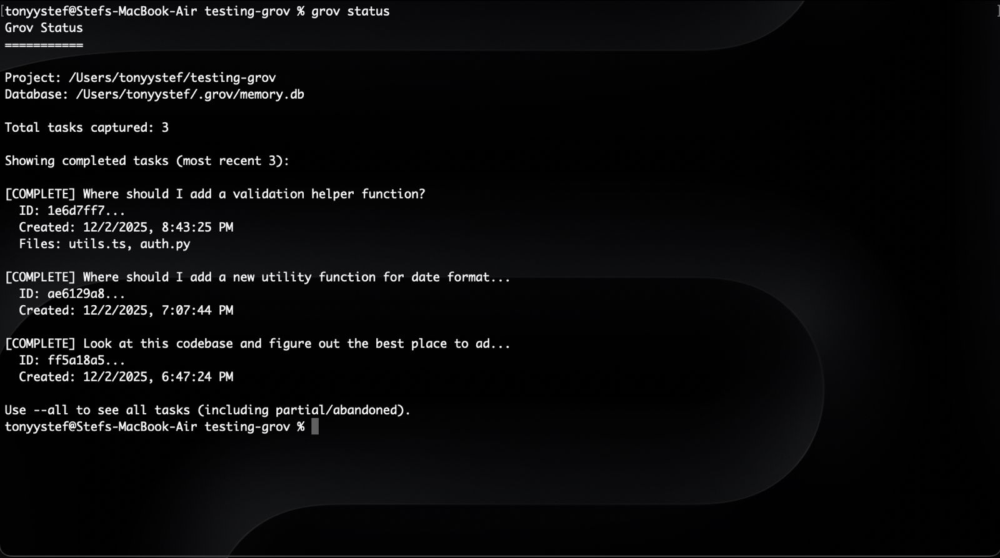
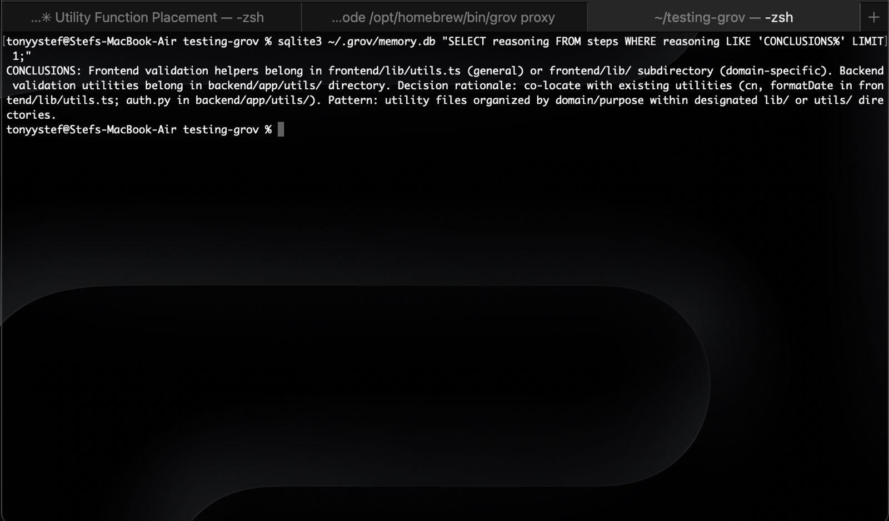

<p align="center">
  
</p>

<h1 align="center">grov</h1>

<p align="center"><strong>Collective AI memory for engineering teams.</strong></p>

<p align="center">
  <a href="https://www.npmjs.com/package/grov"></a>
  <a href="https://www.npmjs.com/package/grov"></a>
  <a href="https://github.com/TonyStef/Grov/blob/main/LICENSE"></a>
</p>

<p align="center">
  <a href="https://grov.dev">Website</a> •
  <a href="https://app.grov.dev">Dashboard</a> •
  <a href="#quick-start">Quick Start</a> •
  <a href="#team-sync">Team Sync</a> •
  <a href="#contributing">Contributing</a>
</p>

Grov captures reasoning from your Claude Code sessions and injects it into future sessions. Your AI remembers what it learned.

## The Problem

Every time you start a new Claude Code session:
- Claude re-explores your codebase from scratch
- It reads the same files again
- It rediscovers patterns you've already established
- You burn tokens on redundant exploration

**Measured impact:** A typical task takes 10+ minutes, 7%+ token usage, and 3+ explore agents just to understand the codebase.*

## The Solution

Grov captures what Claude learns and injects it back on the next session.



### What Gets Captured

Real reasoning, not just file lists:



*Architectural decisions, patterns, and rationale - automatically extracted.*

## Quick Start

```bash
npm install -g grov   # Install
grov init             # Configure (one-time)
grov proxy            # Start (keep running)
```

Then use Claude Code normally in another terminal. That's it.

## How It Works

```
Session 1: Claude learns about your auth system
           ↓
        grov captures: "Auth tokens refresh in middleware/token.ts:45,
                        using 15-min window to handle long forms"
           ↓
Session 2: User asks about related feature
           ↓
        grov injects: Previous context about auth
           ↓
        Claude skips exploration, reads files directly
```

## Commands

```bash
grov init         # Configure proxy URL (one-time)
grov proxy        # Start the proxy (required)
grov proxy-status # Show active sessions
grov status       # Show captured tasks
grov login        # Login to cloud dashboard
grov sync         # Sync memories to team dashboard
grov disable      # Disable grov
```

## Data Storage

- **Database:** `~/.grov/memory.db` (SQLite)
- **Per-project:** Context is filtered by project path
- **Local by default:** Memories stay on your machine unless you enable team sync

## Team Sync

Share memories across your engineering team with the cloud dashboard.

```bash
grov login                    # Authenticate via GitHub
grov sync --enable --team ID  # Enable sync for a team
```

Once enabled, memories automatically sync to [app.grov.dev](https://app.grov.dev) where your team can:
- Browse all captured reasoning
- Search across sessions
- Invite team members
- See who learned what

Memories sync automatically when sessions complete - no manual intervention needed.

## Requirements

- Node.js 18+
- Claude Code

---

## Advanced Features

### Anti-Drift Detection

Grov monitors what Claude **does** (not what you ask) and corrects if it drifts from your goal.

- Extracts your intent from the first prompt
- Monitors Claude's actions (file edits, commands, explorations)
- Uses Claude Haiku to score alignment (1-10)
- Injects corrections at 4 levels: nudge → correct → intervene → halt

```bash
# Test drift detection
grov drift-test "refactor the auth system" --goal "fix login bug"
```

### Extended Cache (Experimental)

Anthropic's prompt cache expires after 5 minutes of inactivity. If you pause to think between prompts, the cache expires and must be recreated (costs more, takes longer).

```bash
grov proxy --extended-cache
```

**What this does:** Sends minimal keep-alive requests (~$0.002 each) during idle periods to preserve your cache.

**Important:** By using `--extended-cache`, you consent to Grov making API requests on your behalf to keep the cache active. These requests:
- Use your Anthropic API key
- Are sent automatically during idle periods (every ~4 minutes)
- Cost approximately $0.002 per keep-alive
- Are discarded (not added to your conversation)

This feature is **disabled by default** and requires explicit opt-in.

### Environment Variables

```bash
# Required for drift detection and LLM extraction
export ANTHROPIC_API_KEY=sk-ant-...

# Optional
export GROV_DRIFT_MODEL=claude-sonnet-4-20250514  # Override model
export PROXY_HOST=127.0.0.1                        # Proxy host
export PROXY_PORT=8080                             # Proxy port
```

Without an API key, grov uses basic extraction and disables drift detection.

### What Gets Stored

```json
{
  "task": "Fix auth logout bug",
  "goal": "Prevent random user logouts",
  "files_touched": ["src/auth/session.ts", "src/middleware/token.ts"],
  "reasoning_trace": [
    "Investigated token refresh logic",
    "Found refresh window was too short",
    "Extended from 5min to 15min"
  ],
  "status": "complete"
}
```

### What Gets Injected

```
VERIFIED CONTEXT FROM PREVIOUS SESSIONS:

[Task: Fix auth logout bug]
- Files: session.ts, token.ts
- Extended token refresh window from 5min to 15min
- Reason: Users were getting logged out during long forms

YOU MAY SKIP EXPLORE AGENTS for files mentioned above.
```

### How the Proxy Works

1. **`grov init`** sets `ANTHROPIC_BASE_URL=http://127.0.0.1:8080` in Claude's settings
2. **`grov proxy`** intercepts all API calls and:
   - Extracts intent from first prompt
   - Injects context from team memory
   - Tracks actions and detects drift
   - Saves reasoning when tasks complete

---

## Roadmap

- [x] Local capture & inject
- [x] LLM-powered extraction
- [x] Local proxy with real-time monitoring
- [x] Anti-drift detection & correction
- [x] Team sync (cloud backend)
- [x] Web dashboard
- [ ] Semantic search
- [ ] VS Code extension

## Contributing

1. **Fork the repo** and clone locally
2. **Install dependencies:** `npm install`
3. **Build:** `npm run build`
4. **Test locally:** `node dist/cli.js --help`

```bash
npm run dev              # Watch mode
node dist/cli.js init    # Test CLI
```

Found a bug? [Open an issue](https://github.com/TonyStef/Grov/issues).

## License

Apache License 2.0 - see [LICENSE](LICENSE) file for details.
